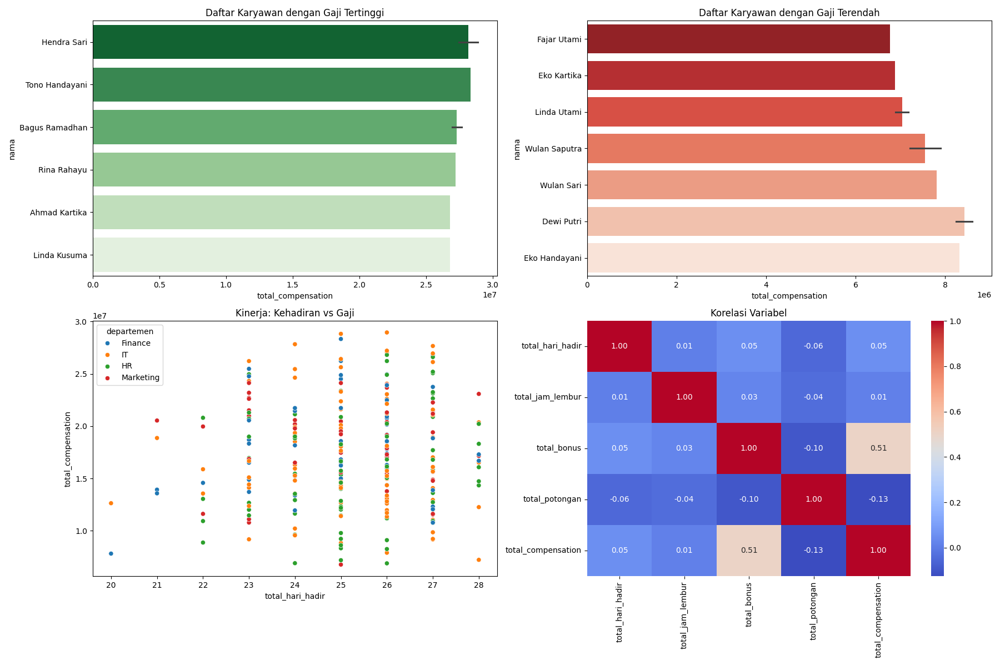

# 📁 Tentang Projek Payroll System

## 📘 Mata Kuliah: Big Data

### 📌 Judul

**Proyek Implementasi Big Data: Sistem Penghitung Gaji Karyawan**

### 📝 Deskripsi Kasus

Sistem ini mengelola dan menganalisis data kehadiran, performa, dan kompensasi karyawan. Penghitungan gaji dilakukan secara harian, mingguan, bulanan, dan tahunan — dengan mempertimbangkan bonus, lembur, serta pemotongan akibat ketidakhadiran, keterlambatan, dan pelanggaran.

---

## 👤 Pembuat

**Deni Permana - 2210512015**

---

## 📦 Data

📊 Struktur Tabel Data

### 🧍‍♂️ Tabel Karyawan

<table>
<thead>
<tr>
<th>Kolom</th><th>Deskripsi</th>
</tr>
</thead>
<tbody>
<tr><td>karyawan_id (PK)</td><td>ID unik karyawan</td></tr>
<tr><td>nama</td><td>Nama lengkap</td></tr>
<tr><td>jabatan</td><td>Posisi/jabatan</td></tr>
<tr><td>departemen</td><td>Departemen</td></tr>
<tr><td>tanggal_masuk</td><td>Tanggal mulai bekerja</td></tr>
<tr><td>gaji_pokok</td><td>Gaji pokok per bulan</td></tr>
<tr><td>status_kepegawaian</td><td>Tetap/Kontrak/Probation</td></tr>
<tr><td>email</td><td>Email karyawan</td></tr>
<tr><td>nomor_telepon</td><td>No. Telepon</td></tr>
</tbody>
</table>

### ⏰ Tabel Kehadiran

<table>
<thead>
<tr>
<th>Kolom</th><th>Deskripsi</th>
</tr>
</thead>
<tbody>
<tr><td>kehadiran_id (PK)</td><td>ID unik kehadiran</td></tr>
<tr><td>karyawan_id (FK)</td><td>ID karyawan</td></tr>
<tr><td>tanggal</td><td>Tanggal kehadiran</td></tr>
<tr><td>waktu_masuk</td><td>Jam masuk</td></tr>
<tr><td>waktu_keluar</td><td>Jam keluar</td></tr>
<tr><td>status_kehadiran</td><td>Hadir/Izin/Sakit/Tanpa keterangan</td></tr>
<tr><td>keterlambatan_menit</td><td>Menit terlambat</td></tr>
<tr><td>keterangan</td><td>Keterangan tambahan</td></tr>
</tbody>
</table>

### ⏳ Tabel Lembur

<table>
<thead>
<tr>
<th>Kolom</th><th>Deskripsi</th>
</tr>
</thead>
<tbody>
<tr><td>lembur_id (PK)</td><td>ID unik lembur</td></tr>
<tr><td>karyawan_id (FK)</td><td>ID karyawan</td></tr>
<tr><td>tanggal</td><td>Tanggal lembur</td></tr>
<tr><td>jam_mulai</td><td>Waktu mulai</td></tr>
<tr><td>jam_selesai</td><td>Waktu selesai</td></tr>
<tr><td>durasi_jam</td><td>Lama lembur (jam)</td></tr>
<tr><td>status_approval</td><td>Disetujui/Ditolak</td></tr>
<tr><td>keterangan</td><td>Keterangan lembur</td></tr>
</tbody>
</table>

### ⚠️ Tabel Pelanggaran

<table>
<thead>
<tr>
<th>Kolom</th><th>Deskripsi</th>
</tr>
</thead>
<tbody>
<tr><td>pelanggaran_id (PK)</td><td>ID unik pelanggaran</td></tr>
<tr><td>karyawan_id (FK)</td><td>ID karyawan</td></tr>
<tr><td>tanggal</td><td>Tanggal pelanggaran</td></tr>
<tr><td>jenis_pelanggaran</td><td>Kategori pelanggaran</td></tr>
<tr><td>deskripsi</td><td>Detail pelanggaran</td></tr>
<tr><td>tingkat_keparahan</td><td>Ringan/Sedang/Berat</td></tr>
<tr><td>sanksi_potongan</td><td>Potongan gaji</td></tr>
</tbody>
</table>

### 💰 Tabel Bonus

<table>
<thead>
<tr>
<th>Kolom</th><th>Deskripsi</th>
</tr>
</thead>
<tbody>
<tr><td>bonus_id (PK)</td><td>ID unik bonus</td></tr>
<tr><td>karyawan_id (FK)</td><td>ID karyawan</td></tr>
<tr><td>periode_bulan</td><td>Bulan bonus</td></tr>
<tr><td>periode_tahun</td><td>Tahun bonus</td></tr>
<tr><td>jenis_bonus</td><td>Performa/Proyek/Lainnya</td></tr>
<tr><td>jumlah_bonus</td><td>Nominal bonus</td></tr>
<tr><td>keterangan</td><td>Keterangan bonus</td></tr>
</tbody>
</table>

---

## 📊 Laporan Visualisasi Gaji

